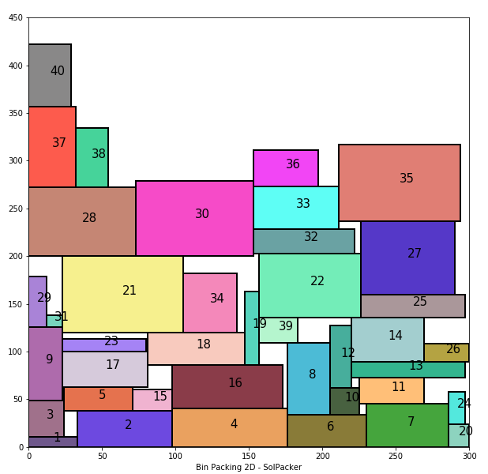

# rectpack

Rectpack is a collection of algorithms for solving the 2D knapsack problem,
or packing as much rectangles as possible into another one.




Installation
============

Just dowload the package or clone the repository, Then install with:

```bash
python setup.py install
```

Basic Usage
===========

Packing rectangles in a number of bins is very simple:

```python
from rectpack import newPacker

rectangles = [(100, 30), (40, 60), (30, 30), .....]
bins = [(300, 450), (80, 40), ...]

packer = newPacker()

# Add all the rectangles to be packed
for r in rectangles:
	packer.add_rect(*r)

# Add bins where the rectangles will be placed
for b in bins:
	packer.add_bin(*b)

# Do packing
packer.pack()

# Iterate through each bin and obtain a list of rectangle positions
# format [(x0, y0, w0, h0, rid0), (x1, y1, w1, h1, rid1), ...]
#	x -> Lower-left corner x coordinate
#	y -> Lower-left forner y coordinate
#	w -> Width
#	h -> Height
#	rid -> User asigned id or None
for bin in packer:
	for rect in bin.get_rect_list()
		# Do something with the rectangles
```

All the dimmensions and positions must be integers, used float2dec to convert
float values to integers. (see float below)

Algorithms
==========

This library implements three of the algorithms described in [1] an excellent
survey of packing algorithms, Skyline, Maxrects, and Guillotine.

To select an specific algorithm for packing:

```python
form rectpack import *

pack = newPacker(pack_algo=MaxRectsBssf)
```

The list of available algorithms is as follows:

* MaxRects
	* MaxRectsBl
	* MaxRectsBssf
	* MaxRectsBaf
	* MaxRectsBlsf

* Skyline
	* SkylineMwf
	* SkylineMwfl
	* SkylineBl
	* SkylineBlWm
	* SkylineMwfWm
	* SkylineMwflWm

* Guillotine
	* GuillotineBssfSas
	* GuillotineBssfLas
	* GuillotineBssfSlas
	* GuillotineBssfLlas
	* GuillotineBssfMaxas
	* GuillotineBssfMinas
	* GuillotineBlsfSas
	* GuillotineBlsfLas
	* GuillotineBlsfSlas
	* GuillotineBlsfLlas
	* GuillotineBlsfMaxas
	* GuillotineBlsfMinas
	* GuillotineBafSas
	* GuillotineBafLas
	* GuillotineBafSlas
	* GuillotineBafLlas
	* GuillotineBafMaxas
	* GuillotineBafMinas

The nomenclature used is the same as described in [1], if you don't want to read
anything I recomend the default algorithm unles the number of rectangles is too
big and the packing is slow, in that case change to the Guillotine that
gives you the best result.

Testing
=======

Rectpack is thoroughly tested, run the test with the following command:

```bash
python setup.py test
```

Float
=====

Most of the packing algorithms implemented have problems with float rounding 
errors which can result in collisions.
If you need to use floats just convert them to fixed-point using Decimal 
rounding up so the actual rectangle size is always smaller than the conversion.
Rectpack provides helper funcion **float2dec** for this task:

```python
	from rectpack import float2dec, newPacker

	float_rects = [...] 
	dec_rects = [(float2dec(r[0], 3), float2dec(r[1], 3)) for r in float_rects]
				
	p = newPacker()
	
	....
```

References
==========

[1] Jukka Jylang - A Thousand Ways to Pack the Bin - A Practical Approach to Two-Dimensional
Rectangle Bin Packing (2010)

[2] Huang, E. Korf - Optimal Rectangle Packing: An Absolute Placement Approach (2013)
